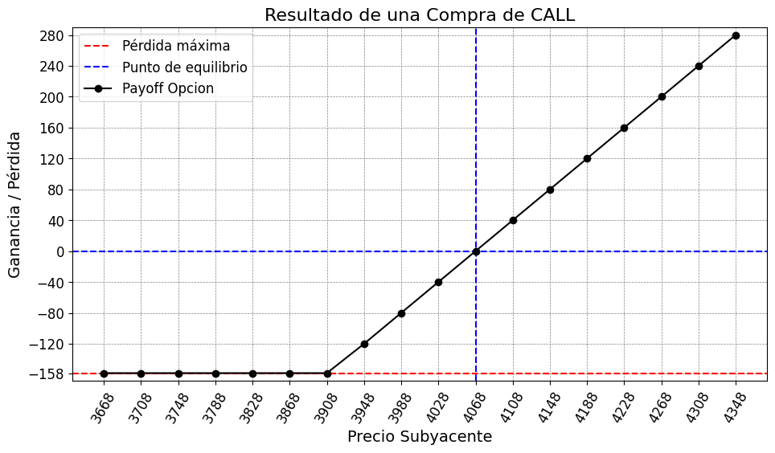

# Análisis de Opciones Financieras CALL

Este repositorio contiene herramientas y análisis para el estudio de opciones financieras CALL utilizando Python.

## Descripción

El proyecto incluye:
- Análisis de opciones financieras
- Cálculo de precios de opciones
- Visualización de datos financieros
- Herramientas para el análisis técnico

## Tipos de Opciones CALL

### Compra CALL

Comprar una opción call es una estrategia alcista que ofrece un beneficio potencialmente ilimitado y tiene una pérdida limitada. Es la estrategia alcista simple más intuitiva y es ideal si estamos convencidos de qué una acción va a subir de precio de manera significativa.

- `Beneficio Potencial`: Ilimitado
- `Perdida Potencial`: Limitada (la prima pagada)
- `Estrategia Optima`: Si el subyacente sube de precio de manera significativa
- `Qué se Paga`: Una prima, que es el coste de la opción

### Venta CALL

Vender una opción call es una estrategia bajista que ofrece una ganancia potencialmente limitado y tiene una pérdida ilimitada. Es ideal si estamos convencidos de qué una acción no va a subir de precio de manera significativa.

- `Beneficio Potencial`: Limitado (la prima recibida)
- `Perdida Potencial`: Ilimitada
- `Estrategia Optima`: Si el precio del activo cae por debajo del precio de ejercicio
- `Qué Se Recibe`: Una prima, que es el coste de la opción y la ganacia obtenida hasta su vencimiento.

### Link de Interes

https://www.investing.com/academy/trading/call-put-options/

## Requisitos

Para ejecutar este proyecto, necesitas tener instalado:

- `Python 3.x`: Lenguaje de programación principal utilizado en el proyecto
- `pandas`: Biblioteca para manipulación y análisis de datos, especialmente útil para trabajar con DataFrames y series temporales
- `numpy`: Biblioteca fundamental para computación científica, proporciona soporte para arrays multidimensionales y operaciones matemáticas
- `matplotlib`: Biblioteca para visualización de datos, permite crear gráficos y visualizaciones interactivas
- `openpyxl`: Biblioteca para leer y escribir archivos Excel (.xlsx), utilizada para la exportación de resultados

## Uso

El proyecto incluye el scripts que perm

- `compra_call.py`: Script principal para el análisis de opciones de compra CALL
- `venta_call.py`: Script principal para el análisis de opciones de compra CALL
- `resultados`: Carpeta donde se guarda el resultado de los payoff de las opciones en formato xlsx

## Explicación de Parámetros

Los principales parámetros utilizados en el análisis de opciones son:

- `precio_strike`: Es el precio de ejercicio de la opción, es decir, el precio al que el comprador puede ejercer su derecho a comprar (en el caso de una opción call) o vender (en el caso de una opción put) el activo subyacente.

- `prima`: Es el costo de la opción, también conocido como precio de la opción. Representa la cantidad que el comprador paga al vendedor por adquirir el derecho que otorga la opción.

- `cant_contratos`: Indica la cantidad de contratos de opciones que se están analizando. Cada contrato generalmente representa 100 acciones del activo subyacente.

- `rango`: Define el intervalo de precios alrededor del precio de equilibrio que se utilizará para el análisis. Este parámetro ayuda a visualizar cómo se comportaría la opción en diferentes escenarios de precios del activo subyacente.

## Cálculo de Precios y Payoff

El análisis de opciones incluye dos componentes principales:

### 1. Generación del Rango de Precios
- Se crea un rango de precios centrado en el punto de equilibrio
- El rango se extiende tanto por encima como por debajo del punto de equilibrio
- Se utiliza la fórmula: `precios = np.arange(punto_equilibrio - rango*10, punto_equilibrio + rango*8, rango)`
- Se verifica que el punto de equilibrio esté incluido en el rango de precios
- Los precios se ordenan de menor a mayor para facilitar el análisis

### 2. Cálculo del Payoff
- Para cada precio en el rango generado, se calcula el resultado financiero
- La fórmula utilizada es: `resultado = max(0, precio_sub - precio_strike) - prima`
- El resultado se multiplica por la cantidad de contratos para obtener el payoff total
- Los datos se almacenan en una lista con el formato: `[precio_sub, resultado * cant_contratos]`

### 3. Visualización

Este análisis permite visualizar:
- El punto de equilibrio (donde la ganancia es cero)
- La ganancia potencial en diferentes escenarios de precios
- El riesgo máximo (limitado a la prima pagada)
- La ganancia potencial ilimitada en caso de opciones call

### Ejemplo

#### Compra CALL

#### Venta CALL

## Contribuciones

Las contribuciones son bienvenidas. Por favor, abre un issue para discutir los cambios propuestos.

## 📜 Licencia

Este proyecto se publica con fines educativos y de práctica.

## 📌 Contacto

ecarracedo@gmail.com
