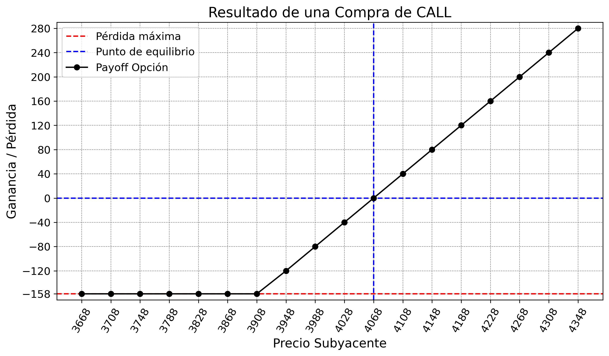
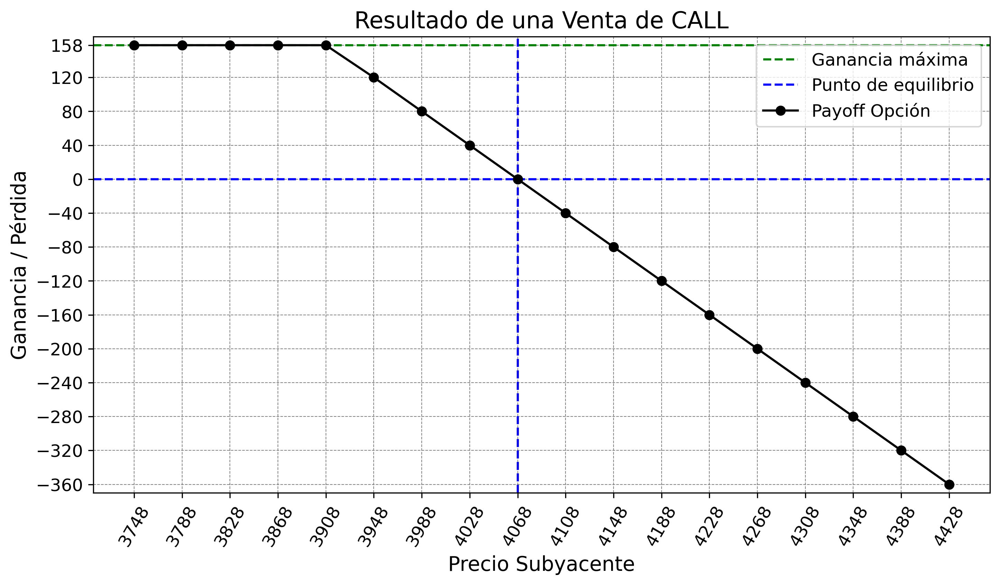

# CALL Financial Options Analysis

This repository contains tools and analysis for the study of CALL financial options using Python.

## Description

The project includes:
- Financial options analysis
- Option pricing calculations
- Financial data visualization
- Technical analysis tools

## Types of CALL Options

### Buy CALL

Buying a call option is a bullish strategy that offers potentially unlimited profit with limited loss. It is the most intuitive bullish simple strategy and is ideal if we are convinced that a stock will rise significantly in price.

- `Potential Profit`: Unlimited
- `Potential Loss`: Limited (the premium paid)
- `Optimal Strategy`: If the underlying rises significantly in price
- `What is paid`: A premium, which is the cost of the option

### Sell CALL

Selling a call option is a bearish strategy that offers limited potential profit and has unlimited loss. It is ideal if we are convinced that a stock will not rise significantly in price.

- `Potential Profit`: Limited (the premium received)
- `Potential Loss`: Unlimited
- `Optimal Strategy`: If the asset price falls below the strike price
- `What is received`: A premium, which is the cost of the option and the profit obtained until expiration

### Useful Links

https://www.investing.com/academy/trading/call-put-options/

## Requirements

To run this project, you need to have installed:

- `Python 3.x`: Main programming language used in the project
- `pandas`: Library for data manipulation and analysis, especially useful for working with DataFrames and time series
- `numpy`: Fundamental library for scientific computing, provides support for multidimensional arrays and mathematical operations
- `matplotlib`: Library for data visualization, allows creating graphs and interactive visualizations
- `openpyxl`: Library for reading and writing Excel files (.xlsx), used for exporting results

## Usage

The project includes scripts that allow:

- `compra_call.py`: Main script for analyzing CALL buy options
- `venta_call.py`: Main script for analyzing CALL sell options
- `resultados`: Folder where option payoff results are saved in xlsx format

## Parameter Explanation

The main parameters used in the options analysis are:

- `precio_strike`: The strike price of the option, i.e., the price at which the buyer can exercise their right to buy (in the case of a call option) or sell (in the case of a put option) the underlying asset.

- `prima`: The option premium, also known as the option price. It represents the amount that the buyer pays to the seller to acquire the right granted by the option.

- `cant_contratos`: Indicates the number of option contracts being analyzed. Each contract typically represents 100 shares of the underlying asset.

- `rango`: Defines the price range around the breakeven point that will be used for analysis. This parameter helps visualize how the option would behave in different scenarios of the underlying asset's price.

## Price and Payoff Calculation

The options analysis includes two main components:

### 1. Price Range Generation
- A price range centered on the breakeven point is created
- The range extends both above and below the breakeven point
- The formula used is: `precios = np.arange(punto_equilibrio - rango*10, punto_equilibrio + rango*8, rango)`
- It verifies that the breakeven point is included in the price range
- Prices are sorted from lowest to highest to facilitate analysis

### 2. Payoff Calculation
- For each price in the generated range, the financial result is calculated
- The formula used is: `resultado = max(0, precio_sub - precio_strike) - prima`
- The result is multiplied by the number of contracts to obtain the total payoff
- The data is stored in a list with the format: `[precio_sub, resultado * cant_contratos]`

### 3. Visualization

This analysis allows visualizing:
- The breakeven point (where the gain is zero)
- The potential gain in different price scenarios
- The maximum risk (limited to the premium paid)
- The unlimited potential gain in the case of call options

### Example

#### Buy CALL

#### Sell CALL

## Contributions

Contributions are welcome. Please open an issue to discuss the proposed changes.

## 📜 License

This project is published for educational and practice purposes.

## 📌 Contact

ecarracedo@gmail.com 