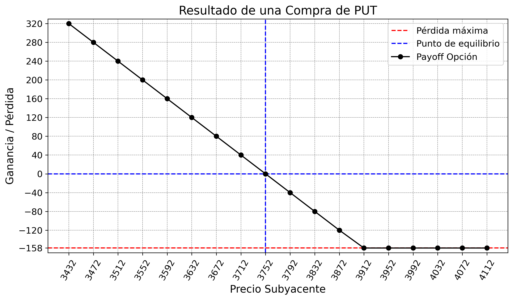

# Análisis de Opciones Financieras PUT

Este repositorio contiene herramientas y análisis para el estudio de opciones financieras PUT utilizando Python.

## Descripción

El proyecto incluye:
- Análisis de opciones PUT
- Cálculo de precios de opciones
- Visualización de datos financieros
- Herramientas para el análisis técnico

## Requisitos

Para ejecutar este proyecto, necesitas tener instalado:

- `Python 3.x`: Lenguaje de programación principal utilizado en el proyecto
- `pandas`: Biblioteca para manipulación y análisis de datos
- `numpy`: Biblioteca para computación científica
- `matplotlib`: Biblioteca para visualización de datos
- `openpyxl`: Biblioteca para leer y escribir archivos Excel (.xlsx)

## Uso

El proyecto incluye:

- `opcion_put.py`: Script principal para el análisis de opciones PUT
- `resultados`: Carpeta donde se guarda el resultado de los payoff de las opciones en formato xlsx

## Explicación de Parámetros

Los principales parámetros utilizados en el análisis de opciones son:

- `precio_strike`: Es el precio de ejercicio de la opción PUT.
- `prima`: Es el costo de la opción.
- `cant_contratos`: Indica la cantidad de contratos de opciones.
- `rango`: Define el intervalo de precios alrededor del precio de equilibrio.

## Cálculo de Precios y Payoff

### 1. Generación del Rango de Precios
- Se crea un rango de precios centrado en el punto de equilibrio
- El punto de equilibrio para una opción PUT es: `precio_strike - prima`

### 2. Cálculo del Payoff
- Para cada precio en el rango generado, se calcula el resultado financiero
- La fórmula utilizada para PUT es: `resultado = max(0, precio_strike - precio_sub) - prima`
- El resultado se multiplica por la cantidad de contratos para obtener el payoff total

### 3. Visualización

Este análisis permite visualizar:
- El punto de equilibrio (donde la ganancia es cero)
- La ganancia potencial en diferentes escenarios de precios
- El riesgo máximo (limitado a la prima pagada)
- La ganancia potencial limitada por el precio de ejercicio menos la prima

### Ejemplo

## Diferencias con opciones CALL

A diferencia de las opciones CALL:
- Las opciones PUT aumentan de valor cuando el precio del activo subyacente disminuye
- El punto de equilibrio es el precio de ejercicio menos la prima
- El beneficio máximo está limitado (si el precio del activo llega a cero)

## Contacto

ecarracedo@gmail.com 